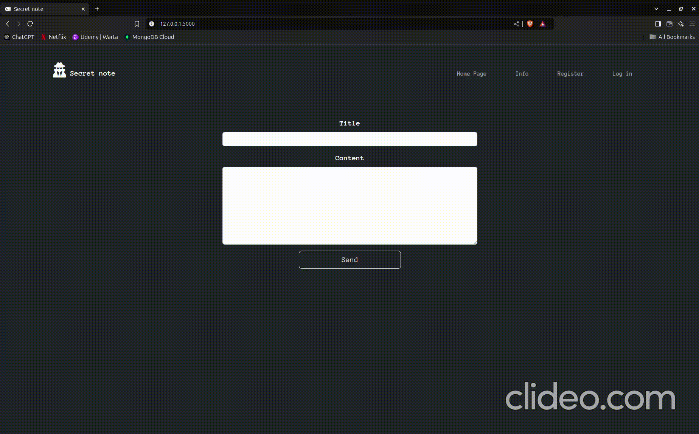

# secret_note

A communicator for sending messages via url. Messages can be displayed only once. After login, direct messages option is provided.

## ⬇️ Run locally

1. Download repository.

2. Install modules: ```$ pip install -r requirements.txt```

3. Run app.

4. Open in your browser and type http://127.0.0.1:5000/ Enjoy :)

## 📹 How it works


